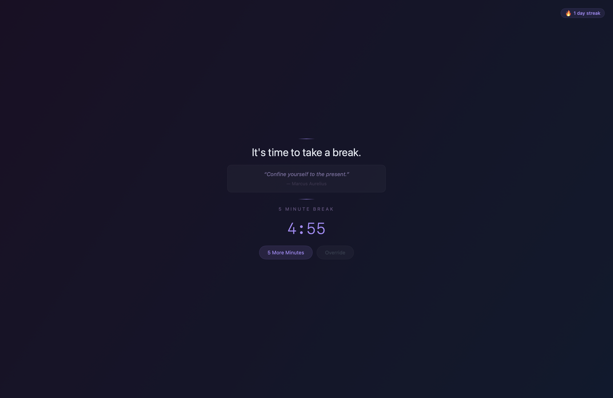
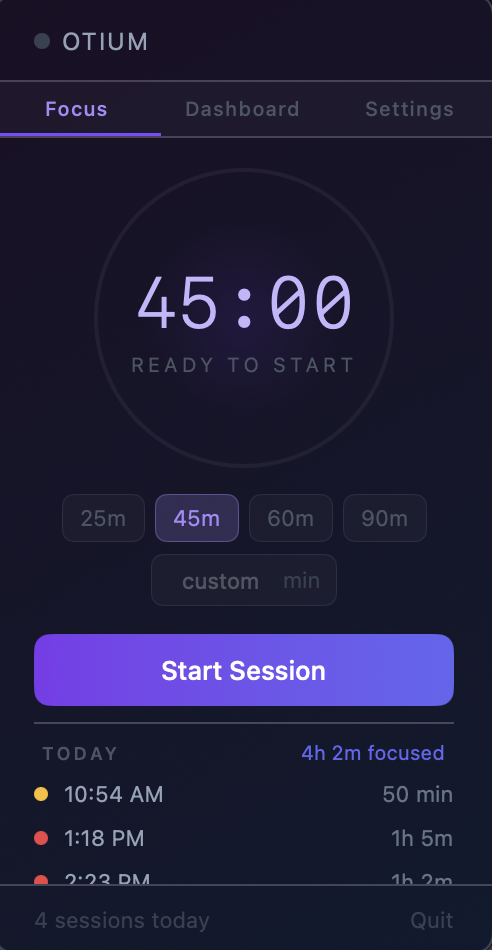
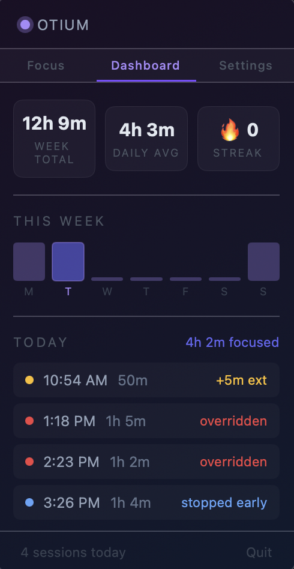

# Otium

Otium is a native macOS menu bar app that enforces structured work/break intervals with a fullscreen dimmed overlay, customisable quotes, and a streak counter.

*Otium* is a Latin abstract term that broadly means "leisure" or "free time". Seneca, a Stoic philosopher of Ancient Rome, elevated it to something more meaningful: the **deliberate withdrawal from busyness** in order to think, reflect, and sharpen the mind.

This app is built around the idea that the break is not lost time, but necessary for focus. If you struggle to take breaks, like myself, I hope this app can help you build healthier habits.

## Screenshots

<p align="center">
  
</p>

<p align="center">
  
  &nbsp;&nbsp;&nbsp;
  
</p>

## What it does

- Set a work session (25, 45, 60, 90 min, or custom)
- When time is up, your screen dims with a fullscreen overlay and a rotation of customizable quotes (set by default to those from my favorite stoic authors and philosophers).
- Take the 5-minute break, or use **5 More Minutes** once per session (streak-safe)
- **Override** is always available — but it resets your streak to 0
- **Stop Session** early and your focus time is still logged if you made it past the halfway point of your session
- **Focus tab** — animated progress ring around the clock, today's sessions listed below
- **Dashboard tab** — week total, daily average, streak, bar chart, and a per-day session list
- **Settings tab** — customise the break overlay messages
- Streak and "today" data update at midnight without restarting the app

## Requirements

- macOS 14.0+
- Xcode 15+

## Setup

```bash
git clone https://github.com/srafatzand/Otium.git
cd Otium
open Otium.xcodeproj
```

Press `⌘R` to build and run. The app lives in your menu bar (no Dock icon).

## Running tests

```bash
xcodebuild test -scheme Otium -destination 'platform=macOS'
```

Or press `⌘U` in Xcode.

## Project structure

| Path | Purpose |
|---|---|
| `Otium/Models/` | `Session` (with `.completed` / `.overridden` / `.stopped` outcomes), `TimerState`, `Message` |
| `Otium/Stores/` | Persistence: streak, sessions, messages (UserDefaults) |
| `Otium/ViewModels/` | `TimerViewModel` — state machine, countdown, sleep/wake |
| `Otium/MenuBar/` | `StatusBarController` — ring+countdown icon, popover, click-outside dismiss |
| `Otium/Overlay/` | `OverlayWindowController` — multi-monitor break screen |
| `Otium/Views/` | SwiftUI views: `PopoverView` (3-tab nav), `TimerControlView`, `DashboardView`, `BreakOverlayView`, `MessagesSettingsView` |
| `OtiumTests/` | XCTest unit tests for stores and view model |

## Docs

- [PRD.md](PRD.md) — Full product requirements
- [PLAN.md](PLAN.md) — Technical implementation plan
- [HANDOFF.md](HANDOFF.md) — Agent handoff notes and architecture decisions
